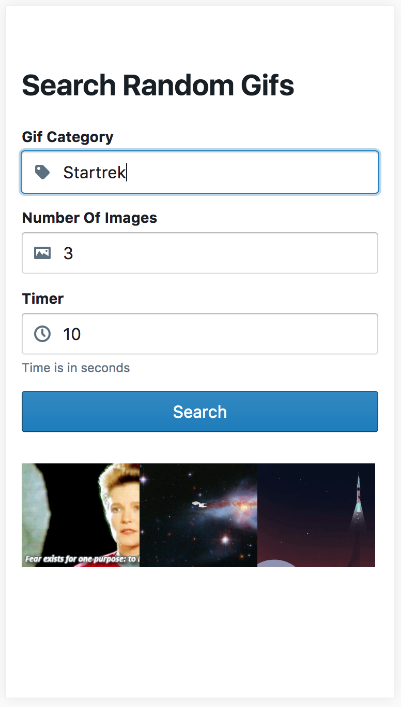

# Applicaster Random Gif Component
> JavaScript Coding assignment

React component that shows 3 random images from Giphy every X seconds using the Giphy api: https://developers.giphy.com/docs/. 

   

## Installation

```sh
yarn install appcalister-test-random-gifs
```

## Usage example

Just import the component and use it in your project


```sh
import RandomGifs from 'appcalister-test-random-gifs/lib'
```


Props | Default Vlalue
------------ | -------------
numberOfImages | 3
timer | 10
showNumberOfImages | true
showTimer | true


## Development setup

Run tests
```sh
yarn
yarn start
```

Run tests
```sh
npm test
```

