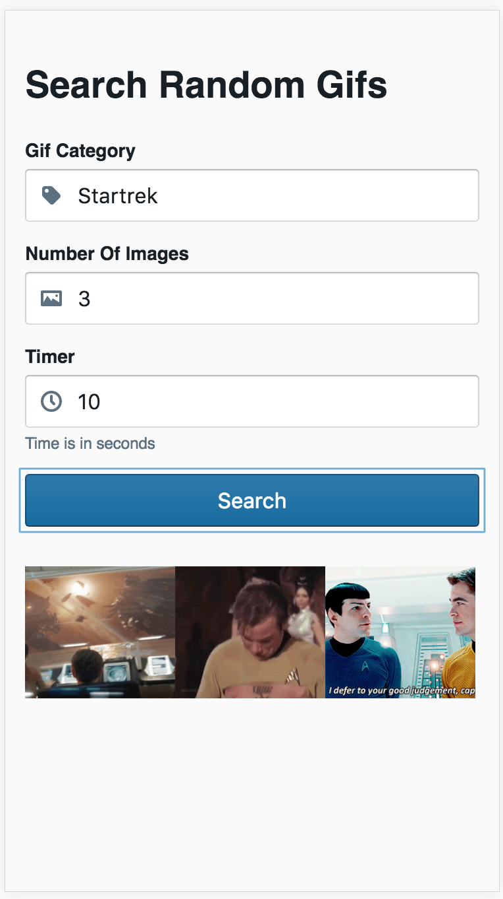

# Applicaster Random Gif Component
> JavaScript Coding assignment

[![NPM Version][npm-image]][npm-url]

React component that shows 3 random images from Giphy every X seconds using the Giphy api: https://developers.giphy.com/docs/. 



## Installation

```sh
yarn install appcalister-test-random-gifs
```

## Usage example

Just import the component and use it in your project

```sh
import RandomGifs from 'appcalister-test-random-gifs/lib'
```

## Development setup

Run tests
```sh
yarn
yarn start
```

Run tests
```sh
npm test
```

